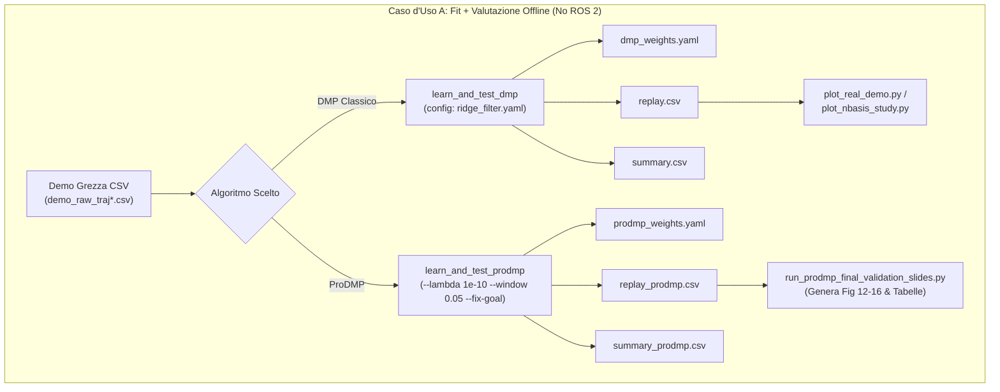
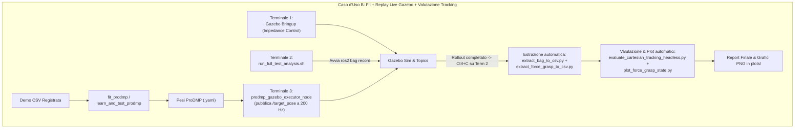

# Inventario Completo degli Strumenti per DMP & ProDMP

Questo documento censisce tutti i tool C++, nodi ROS 2, script Python e script Shell presenti nel workspace per il ciclo di vita delle Primitive di Movimento Dinamiche (DMP classico e ProDMP): **Fit (Apprendimento) $\rightarrow$ Replay/Simulazione $\rightarrow$ Raccolta Dati $\rightarrow$ Valutazione/Plot**.

---

## 1. Tool C++ Offline (Senza dipendenza da ROS 2)

### 1.1 `fit_prodmp`
* **Percorso sorgente**: `src/haptic_dmp_learning/src/tools/fit_prodmp_main.cpp`
* **Binario generato**: `install/haptic_dmp_learning/lib/haptic_dmp_learning/fit_prodmp` (o via colcon build)
* **Scopo**: Fitter offline ufficiale di ProDMP (posizione 3D) a partire da una demo CSV registrata, senza eseguire rollout o metriche.
* **Sintassi CLI esatta**:
  ```bash
  fit_prodmp <demo_raw.csv> <output_prodmp_weights.yaml> [num_basis=20] [--features <path_to_yaml>]
  ```
* **Configurazione e Default**:
  - Legge parametri da `src/haptic_dmp_learning/config/prodmp_features.yaml` (o dal path specificato con `--features`).
  - Parametri letti: `num_basis`, `ridge_lambda`, `position_filter.enabled`, `position_filter.window_sec`, `fix_goal_to_demo_endpoint`.
  - **Limite**: `ridge_lambda`, `window_sec` e `fix_goal` NON possono essere passati direttamente come flag CLI, ma richiedono la modifica o la creazione di un file YAML ad-hoc.
* **Output**:
  - File YAML dei pesi ProDMP (`<output_prodmp_weights.yaml>`) con schema: `num_basis`, `alpha`, `alpha_x`, `tau`, `init_time`, `init_pos`, `init_vel`, `goal`, `centers`, `widths`, `weights_x`, `weights_y`, `weights_z`.
  - Stampa su stdout: `tau`, `learn_residual_rms`, `dropped_non_monotonic_samples`.

---

### 1.2 `learn_and_test_prodmp`
* **Percorso sorgente**: `tools/dmp_offline_test/common/src/learn_and_test_prodmp.cpp`
* **Binario generato**: `tools/dmp_offline_test/build/learn_and_test_prodmp`
* **Scopo**: Apprende ProDMP (posizione) + QuaternionDMP (orientamento fisso a 200 basi) da demo CSV, esegue rollout/replay in-process e calcola tutte le metriche di fedeltà.
* **Sintassi CLI esatta**:
  ```bash
  learn_and_test_prodmp <input_demo.csv> <output_weights.yaml> <output_replay.csv> <summary.csv> <label> [n_basis|-] [alpha_x|-] [alpha_z|-] [beta_z|-] [config_path=''] [--lambda <val>] [--window <val>] [--fix-goal] [--report-condition-number]
  ```
* **Configurazione e Default**:
  - Default YAML fallback: `../../src/haptic_dmp_learning/config/prodmp_features.yaml`.
  - I flag CLI (`--lambda`, `--window`, `--fix-goal`, `--report-condition-number`) sovrascrivono la configurazione YAML.
* **Output**:
  - File pesi ProDMP (`<output_weights.yaml>`).
  - File CSV di replay (`<output_replay.csv>` con colonne `t,x,y,z,qw,qx,qy,qz`).
  - Riga aggiunta a `<summary.csv>` con metriche: `trial,rmse_x_mm,rmse_y_mm,rmse_z_mm,rmse_overall_mm,max_pos_error_mm,mean_angular_error_deg,max_angular_error_deg,endpoint_pos_error_mm,endpoint_orient_error_deg`.

---

### 1.3 `learn_and_test_dmp`
* **Percorso sorgente**: `tools/dmp_offline_test/common/src/learn_and_test_dmp.cpp`
* **Binario generato**: `tools/dmp_offline_test/build/learn_and_test_dmp`
* **Scopo**: Apprende DMP classico (LWR o Ridge + filtro velocità) per posizione e orientamento, genera replay e scrive le metriche.
* **Sintassi CLI esatta**:
  ```bash
  learn_and_test_dmp <input_demo.csv> <output_weights.yaml> <output_replay.csv> <summary.csv> <label> [n_basis|-] [alpha_x|-] [alpha_z|-] [beta_z|-] [feature_config_path='']
  ```
* **Configurazione e Default**:
  - Legge `feature_config_path` (es. `04_basis_sweep/configs/ridge_filter.yaml` o `lwr_nofilter.yaml`).
  - Non ha flag CLI `--lambda` o `--window` (vanno specificati tramite file YAML di configurazione feature).
* **Output**:
  - File YAML combinato (`<output_weights.yaml>`) contenente sezioni `dmp` (posizione) e `quaternion_dmp` (orientamento).
  - File CSV di replay (`<output_replay.csv>`).
  - Riga aggiunta a `<summary.csv>`.

---

### 1.4 `learn_and_test_prodmp_holdout`
* **Percorso sorgente**: `tools/dmp_offline_test/common/src/learn_and_test_prodmp_holdout.cpp`
* **Binario generato**: `tools/dmp_offline_test/build/learn_and_test_prodmp_holdout`
* **Scopo**: Esegue validazione temporale holdout (split train/test 80%/20%) per verificare generalizzazione ed estrapolazione oltre $\tau_{\mathrm{train}}$.
* **Sintassi CLI esatta**:
  ```bash
  learn_and_test_prodmp_holdout <demo.csv> <weights.yaml> <summary.csv> <label> <n_basis> <ridge_lambda> <filter_window> <holdout_fraction>
  ```
* **Configurazione e Default**:
  - Tutti i parametri sono strettamente posizionali; non legge file YAML di configurazione.
* **Output**:
  - File pesi e riga in `<summary.csv>` con metriche `rmse_in_sample_mm`, `rmse_held_out_mm`, `gap_ratio`, `max_abs_weight`.

---

### 1.5 `extract_prodmp_diagnostics`
* **Percorso sorgente**: `tools/dmp_offline_test/common/src/extract_prodmp_diagnostics.cpp`
* **Binario generato**: `tools/dmp_offline_test/build/extract_prodmp_diagnostics`
* **Scopo**: Calcola il numero di condizionamento $\mathrm{cond}(H)$ prima e dopo lo scaling delle colonne e la norma massima dei pesi senza eseguire il rollout.
* **Sintassi CLI esatta**:
  ```bash
  extract_prodmp_diagnostics <demo.csv> <n_basis> <ridge_lambda> <filter_window> [--fix-goal]
  ```
* **Output**:
  - Stampa diagnostica su stdout: `cond(H) unscaled`, `cond(H) scaled`, `max |w|`.

---

### 1.6 `run_goal_generalization` (DMP Classico)
* **Percorso sorgente**: `tools/dmp_offline_test/06_goal_generalization/scripts/run_goal_generalization.cpp`
* **Binario generato**: `tools/dmp_offline_test/06_goal_generalization/plots/build/run_goal_generalization`
* **Scopo**: Apprende DMP una volta, poi testa 5 nuovi goal spaziali/rotazionali tramite `dmp.setGoal()`.
* **Sintassi CLI esatta**:
  ```bash
  run_goal_generalization <demo_csv> <out_dir> <label> [n_basis=100] [feature_config_yaml='']
  ```
* **Output**:
  - `<out_dir>/weights/<label>_weights.yaml`
  - `<out_dir>/data/<label>_replay_orig.csv`
  - `<out_dir>/data/<label>_replay_goal_1.csv` ... `goal_5.csv`
  - `<out_dir>/data/<label>_goals_info.csv`
  - `<out_dir>/goal_generalization_summary.csv`

---

### 1.7 `run_prodmp_goal_generalization` (ProDMP)
* **Percorso sorgente**: `tools/dmp_offline_test/06_goal_generalization/scripts/run_prodmp_goal_generalization.cpp`
* **Binario generato**: `tools/dmp_offline_test/06_goal_generalization/plots/build/run_prodmp_goal_generalization`
* **Scopo**: Apprende ProDMP con `--fix-goal` e testa 5 nuovi goal spaziali tramite `prodmp.setGoal()`.
* **Sintassi CLI esatta**:
  ```bash
  run_prodmp_goal_generalization <demo_csv> <out_dir> <label> [n_basis=80] [lambda=1e-10] [window=0.05]
  ```
* **Output**:
  - `<out_dir>/weights/<label>_prodmp_weights.yaml`
  - `<out_dir>/data/<label>_replay_orig.csv`
  - `<out_dir>/data/<label>_replay_goal_1.csv` ... `goal_5.csv`
  - `<out_dir>/data/<label>_goals_info.csv`

---

### 1.8 Script C++ di Test Storici / Minori
* `tools/dmp_offline_test/01_clean_trajectories/scripts/test_core_offline.cpp`: Test standalone di base su traiettorie sintetiche (hardcoded).
* `tools/dmp_offline_test/02_real_data/scripts/replay_saved_dmp.cpp`: Replayer C++ offline di file YAML di pesi DMP (`./replay_saved_dmp <weights.yaml> [demo.csv]`).
* `tools/dmp_offline_test/03_time_sweep/scripts/generalize_test_dmp.cpp`: Test di generalizzazione su durate $\tau$ diverse per DMP classico.
* `tools/dmp_offline_test/06_goal_generalization/scripts/test_guardrails_rigorous.cpp`: Benchmark per la verifica dei guardrail `kMinDG` e `ratio > 2.0` su DMP classico.

---

## 2. Nodi ROS 2 (Esecuzione Online, Registrazione e Simulazione Gazebo)

### 2.1 `dmp_gazebo_executor_node`
* **Sorgenti**: `src/haptic_dmp_learning/src/ros/dmp_gazebo_executor_node.cpp`, `dmp_executor_main.cpp`
* **Scopo**: Esegue il replay real-time di un DMP classico verso Gazebo o hardware, pubblicando `/target_pose` a 200 Hz.
* **Parametri ROS 2**:
  - `weights_yaml_path` (string, default: `~/thesis_ws/dmp_weights.yaml`): path al file YAML combinato (DMP + QuatDMP).
  - `demo_csv_path` (string, default: `""`): facoltativo, estrae il timestamp di scatto del gripper.
  - `target_pose_topic` (string, default: `"/target_pose"`).
  - `target_odom_topic` (string, default: `"/free_target_object/odometry"`).
  - `target_odom_required` (bool, default: `true`).
  - `control_rate_hz` (double, default: `200.0`).
  - `startup_delay_sec` (double, default: `1.0`).
  - `gripper_open_position`, `gripper_closed_position`, `gripper_close_ramp_duration_sec`.

---

### 2.2 `prodmp_gazebo_executor_node`
* **Sorgenti**: `src/haptic_dmp_learning/src/ros/prodmp_gazebo_executor_node.cpp`, `prodmp_executor_main.cpp`
* **Scopo**: Esegue il replay real-time di ProDMP (posizione) + QuaternionDMP (orientamento) a 200 Hz.
* **Parametri ROS 2**:
  - `weights_yaml_path` (string, default: `~/thesis_ws/prodmp_weights.yaml`): path ai pesi ProDMP.
  - `orientation_weights_yaml_path` (string, default: `""`): path al file YAML contenente la sezione `quaternion_dmp` (obbligatorio se `weights_yaml_path` contiene solo ProDMP).
  - Stessi parametri di controllo, frame TF, gripper e target odom di `dmp_gazebo_executor_node`.

---

### 2.3 `demo_replay_sync_orchestrator_node`
* **Sorgenti**: `src/haptic_dmp_learning/src/ros/demo_replay_sync_orchestrator_node.cpp`, `demo_replay_sync_orchestrator_main.cpp`
* **Launch file**: `src/haptic_dmp_learning/launch/demo_replay_sync.launch.py`
* **Scopo**: Orchestratore temporale per sincronizzare registrazione teleoperata (modo `demo`) e replay su Gazebo (modo `replay`) agganciandosi all'odometria dell'oggetto bersaglio.
* **Parametri ROS 2 obbligatori**:
  - `mode` (string: `"demo"` o `"replay"`).
  - `run_id` (string: obbligatorio in replay, auto-generato se vuoto in demo).
  - `target_name`, `target_x`, `target_y`, `target_z`, `sync_delay_sec`, `use_csv_playback`.

---

### 2.4 `live_demo_recorder_node`
* **Sorgenti**: `src/haptic_dmp_learning/src/ros/live_demo_recorder_node.cpp`, `live_demo_recorder_main.cpp`
* **Launch file**: `src/haptic_dmp_learning/launch/live_demo.launch.py`
* **Scopo**: Registra campioni dal dispositivo aptico su `/master_pose_raw` al premere del pulsante 0 e allena automaticamente il DMP al rilascio/pressione del pulsante 1.
* **Parametri ROS 2**:
  - `n_basis`, `alpha_x`, `alpha_z`, `beta_z` (obbligatori da `config/params.yaml`).
  - `output_yaml_path` (default: `~/thesis_ws/live_demo_dmp_weights.yaml`).
  - `output_demo_csv_path` (default: `~/thesis_ws/live_demo_raw.csv`).
  - `feature_flags_path` (default: `config/dmp_features.yaml`).

---

### 2.5 `haptic_dmp_wrapper_node`
* **Sorgenti**: `src/haptic_dmp_learning/src/ros/haptic_dmp_wrapper_node.cpp`, `main.cpp`
* **Scopo**: Nodo storico per teleoperazione interattiva live con Geomagic Touch (predecessore di `live_demo_recorder_node`).

---

### 2.6 `csv_master_pose_player_node`
* **Sorgenti**: `src/haptic_dmp_learning/src/ros/csv_master_pose_player_node.cpp`, `csv_master_pose_player_main.cpp`
* **Scopo**: Sostituto software del dispositivo aptico fisico Geomagic: legge un CSV registrato e lo riproduce su `/master_pose_raw` con i relativi eventi `/touch0/buttons`.
* **Parametri**: `demo_csv_path`, `publish_rate_hz` (default: 1000 Hz).

---

### 2.7 `grasp_force_calibration_node`
* **Sorgenti**: `src/haptic_dmp_learning/src/ros/grasp_force_calibration_node.cpp`, `grasp_force_calibration_main.cpp`
* **Scopo**: Calibra la firma di forza di contatto registrata durante la demo e ne verifica la consistenza durante il replay.
* **Parametri obbligatori**: `mode` (`"calibrate"` | `"verify"`), `run_id`.

---

### 2.8 `grasp_state_machine_node`
* **Sorgenti**: `src/haptic_dmp_learning/src/ros/grasp_state_machine_node.cpp`, `grasp_state_machine_main.cpp`
* **Scopo**: Macchina a stati finiti che fonde il segnale geometrico di prossimità e la verifica delle forze per confermare la presa dell'oggetto.
* **Parametri**: `hard_force_limit_n` (obbligatorio), `persistence_cycles` (default: 5).

---

### 2.9 `geometric_grasp_monitor_node`
* **Sorgente**: `src/grasp_monitoring/grasp_monitoring/geometric_grasp_monitor_node.py`
* **Scopo**: Nodo Python che calcola puramente via TF/odometria la distanza e l'allineamento tra TCP del robot (`fer_hand_tcp`) e oggetto bersaglio.

---

## 3. Script Python di Supporto, Valutazione e Sweep

### 3.1 Pipeline Gazebo (`tools/gazebo_cartesian_eval/scripts/`)
| Script | Sintassi CLI | Input / Config | Output Prodotti |
| :--- | :--- | :--- | :--- |
| `extract_bag_to_csv.py` | `python3 extract_bag_to_csv.py <path_bag> <run_name> [controller_name]` | ROS 2 Bag sqlite3 | `data/target_aligned_<run>.csv`, `data/actual_pose_<run>.csv` |
| `extract_force_grasp_to_csv.py` | `python3 extract_force_grasp_to_csv.py <path_bag> <run_name> [controller_name]` | ROS 2 Bag sqlite3 | `data/force_<run>.csv`, `data/grasp_state_<run>.csv`, `data/gripper_cmd_<run>.csv`, `data/target_odom_<run>.csv` |
| `evaluate_cartesian_tracking.py` | `python3 evaluate_cartesian_tracking.py [run_name]` | `target_aligned_*.csv`, `actual_pose_*.csv` | Metriche a console + plot interattivo salvato in `plots/02_gazebo_tracking/cartesian_tracking_<run>.png` |
| `evaluate_cartesian_tracking_headless.py` | `python3 evaluate_cartesian_tracking_headless.py <run_name>` | Stessi CSV | Stesse metriche stampate in CSV format su stdout + plot salvato in `plots/03_gain_sweep/cartesian_tracking_<run>.png` |
| `plot_force_grasp_state.py` | `python3 plot_force_grasp_state.py <run_name> [hard_force_limit_n]` | CSV di forza e stato | Plot 3-subplot salvato in `plots/04_grasp_test/force_grasp_state_<run>.png` |
| `log_nullspace_leak.py` | `python3 log_nullspace_leak.py [leak_topic] [target_pose_topic] [inactivity_timeout] [safety_timeout]` | Topic ROS 2 `/cartesian_impedance_controller/nullspace_leak` | Stampa metrica `RESULT_LINE leak_lin_mean=...` |
| `plot_gain_sweep_heatmap.py` | `python3 plot_gain_sweep_heatmap.py <csv> <col_k> <col_d>` | CSV di sintesi sweep guadagni | Heatmap 2D salvata come `<csv>_heatmap.png` |

---

### 3.2 Pipeline Offline & Sweep Studio (`tools/dmp_offline_test/`)
| Script | Percorso Completo | Scopo e Parametri |
| :--- | :--- | :--- |
| `run_prodmp_final_validation_slides.py` | `tools/dmp_offline_test/04_basis_sweep/scripts/run_prodmp_final_validation_slides.py` | **Master script** per validazione finale ProDMP (Task 1: sweep $n$, Task 2: sweep $w$, Task 3: lambda, Task 4: replay, Task 5: goal gen). Genera `fig12`–`fig16` e tabelle in `slides_material/`. |
| `generate_slidestyle_figures.py` | `tools/dmp_offline_test/04_basis_sweep/scripts/generate_slidestyle_figures.py` | Genera figure slide per Chapter 07 (`fig1`, `fig3`, `fig4`, `fig8`, `fig11`, `table_final_summary`). |
| `run_joint_grid_search_prodmp.py` | `tools/dmp_offline_test/04_basis_sweep/scripts/run_joint_grid_search_prodmp.py` | Grid search 3D ($n_{\mathrm{basis}} \times \lambda \times w$) su Traiettoria C. |
| `run_holdout_study_prodmp.py` | `tools/dmp_offline_test/04_basis_sweep/scripts/run_holdout_study_prodmp.py` | Sweep temporale holdout 80/20 su Traiettorie C e A. |
| `run_perturbation_stability_colored_noise.py` | `tools/dmp_offline_test/04_basis_sweep/scripts/run_perturbation_stability_colored_noise.py` | Test di perturbazione a rumore colorato passa-basso ($f_c=0.5\,\mathrm{Hz}$). |
| `plot_pose_csvs.py` | `tools/dmp_offline_test/common/scripts/plot_pose_csvs.py` | Tool generico per overlay di più traiettorie CSV con opzioni di allineamento `--align i:j`, trimming `--trim-idle` e durata `--duration i:sec`. |
| `record_pose_topic.py` | `tools/dmp_offline_test/common/scripts/record_pose_topic.py` | Registratore ROS 2 standalone di un topic `PoseStamped` su CSV. |
| `plot_nbasis_study.py` | `tools/dmp_offline_test/common/scripts/plot_nbasis_study.py` | Genera grafici logaritmici comparativi per sweep su numero di basi. |
| `aggregate_nbasis_seeds.py` | `tools/dmp_offline_test/common/scripts/aggregate_nbasis_seeds.py` | Aggrega medie e deviazioni standard su più seed di rumore. |
| `evaluate_moving_average_filter.py` | `tools/dmp_offline_test/05_vel_filt_test/scripts/evaluate_moving_average_filter.py` | Valuta filtro a media mobile a due stadi su velocità/accelerazioni rispetto a ground truth analitica. |
| `plot_goal_generalization.py` | `tools/dmp_offline_test/06_goal_generalization/scripts/plot_goal_generalization.py` | Plot 3D + time series per generalizzazione a 5 nuovi goal. |
| `plot_guardrails_rigorous.py` | `tools/dmp_offline_test/06_goal_generalization/scripts/plot_guardrails_rigorous.py` | Plot di confronto errore $e(t)$ con e senza guardrail per DMP classico. |

---

## 4. Script Shell di Orchestrazione (.sh)

### 4.1 Orchestrazione Gazebo (`tools/gazebo_cartesian_eval/scripts/`)
* `record_bag.sh <run_name> [controller_name]`: Registra solo topic cinematici (`target_pose_aligned`, `actual_pose`, `joint_states`).
* `record_full_test_bag.sh <run_name> [controller_name]`: Registra tracking + forze + stato grasp + gripper + target odom.
* `run_full_test_analysis.sh <run_name> [controller] [hard_force_limit]`: **Script all-in-one** (registra, poi con Ctrl-C estrae tutti i CSV e genera tutti i plot).
* `run_reach_task_comparison.sh [weights_yaml]`: Confronto automatico tra Velocity Control e Impedance Control lanciando Gazebo headless.
* `run_translation_gain_sweep.sh`, `run_rotation_gain_sweep.sh`, `run_nullspace_stiffness_sweep.sh`: Sweep automatici dei guadagni di impedenza.

### 4.2 Orchestrazione Offline (`tools/dmp_offline_test/`)
* `01_clean_trajectories/scripts/build_and_run.sh`: Compila ed esegue test su traiettorie sintetiche.
* `02_real_data/scripts/replay_build_and_run.sh [weights.yaml] [demo.csv]`: Compila ed esegue replayer C++.
* `02_real_data/scripts/run_real_trajectories_sweep.sh [n_basis]`: Esegue sweep su Traj A, B, C con LWR vs Ridge.
* `03_time_sweep/scripts/build_and_run_timesweep.sh`: Sweep su durate temporali sintetiche.
* `03_time_sweep/scripts/run_generalization_sweep.sh <duration_s>`: Generalizzazione temporale DMP.
* `04_basis_sweep/scripts/run_nbasis_sweep.sh`: Sweep su numero di basi DMP classico.
* `04_basis_sweep/scripts/run_nbasis_sweep_prodmp.sh`: Sweep su numero di basi ProDMP.
* `04_basis_sweep/scripts/run_ridge_lambda_sweep.sh`: Sweep $\lambda$ DMP classico.
* `04_basis_sweep/scripts/run_ridge_lambda_sweep_prodmp.sh`: Sweep $\lambda$ ProDMP.
* `04_basis_sweep/scripts/run_filter_window_sweep.sh`: Sweep finestra filtro DMP classico.
* `04_basis_sweep/scripts/run_filter_window_sweep_prodmp.sh`: Sweep finestra filtro ProDMP.
* `06_goal_generalization/scripts/run_new_goals.sh`: Generalizzazione su 5 goal per DMP classico.
* `06_goal_generalization/scripts/run_rigorous_guardrail_tests.sh`: Test guardrail DMP classico.

---

## 5. Analisi Critica: Duplicazioni, Inconsistenze e Gap

### 5.1 Duplicazioni
1. **Fit di ProDMP implementato in 3 eseguibili distinti**:
   - `fit_prodmp_main.cpp` (fitter ufficiale ROS 2 package tools).
   - `learn_and_test_prodmp.cpp` (fitter + rollout + summary per offline tests).
   - `run_prodmp_goal_generalization.cpp` (fitter + 5 goal replayer).
2. **Replay in C++**:
   - Replay embedded dentro `learn_and_test_prodmp.cpp`.
   - Replay embedded dentro `learn_and_test_dmp.cpp`.
   - Replayer dedicato `replay_saved_dmp.cpp`.
   - Replay live dentro i nodi ROS 2 `dmp_gazebo_executor_node` e `prodmp_gazebo_executor_node`.
3. **Calcolo Metriche di Errore**:
   - Implementato in C++ in `tools/dmp_offline_test/common/src/metrics.cpp`.
   - Re-implementato parzialmente in Python in `evaluate_cartesian_tracking.py`, `plot_real_demo.py`, `plot_reach_task_baseline.py`, `run_prodmp_final_validation_slides.py`.

### 5.2 Inconsistenze di Interfaccia CLI
1. **Passaggio Iperparametri (Posizionale vs Flag)**:
   - `fit_prodmp`: richiede file YAML per $\lambda$ e window; solo `n_basis` è posizionale facoltativo.
   - `learn_and_test_prodmp`: accetta sia posizionali sia flag `--lambda`, `--window`, `--fix-goal`.
   - `learn_and_test_dmp`: accetta solo file YAML `feature_config_path`.
   - `learn_and_test_prodmp_holdout`: accetta 8 argomenti strettamente posizionali senza flag.
2. **Separazione Pesi Posizione / Orientamento in ProDMP**:
   - DMP classico salva posizione e orientamento nello stesso file YAML (`dmp` e `quaternion_dmp`).
   - ProDMP salva solo la posizione nel suo file YAML (`num_basis`, `weights_x`, ...). Quando si lancia `prodmp_gazebo_executor_node`, serve passare separatamente `weights_yaml_path` e `orientation_weights_yaml_path` (puntando a un vecchio YAML del DMP classico).

### 5.3 Parametri Ripetuti Manualmente (Candidati a Centralizzazione)
* La configurazione ottimale ProDMP (`n_basis=80`, `ridge_lambda=1e-10`, `position_filter_window_sec=0.05`, `fix_goal_to_demo_endpoint=true`) oggi:
  - È scritta in `src/haptic_dmp_learning/config/prodmp_features.yaml` per `fit_prodmp`.
  - Ma per gli script di sweep o nodi offline viene spesso passata riga per riga da riga di comando (`--lambda 1e-10 --window 0.05 --fix-goal`).
  - Serve un unico file sorgente di verità per i default di produzione sia C++ sia ROS 2.

### 5.4 Passaggi Manuali e Mancanza di Automazione
1. **Flusso Demo $\rightarrow$ Pesi $\rightarrow$ Plot**:
   - Nel DMP classico serviva: (1) `learn_and_test_dmp`, (2) `plot_real_demo.py` o `plot_dmp_timesweep.py`.
   - Con ProDMP serviva invocare `learn_and_test_prodmp` e poi script Python custom.
   - *Nota*: `run_prodmp_final_validation_slides.py` ha dimostrato che un singolo wrapper può orchestrare fit, replay, metriche e plot in modo completamente automatico.
2. **Flusso Gazebo**:
   - `run_full_test_analysis.sh` automatizza l'estrazione e il plot del bag, ma richiede comunque l'avvio manuale del launch file e dell'executor in terminali separati.

---

## 6. Grafo delle Dipendenze e Sequenze di Utilizzo Tipiche




